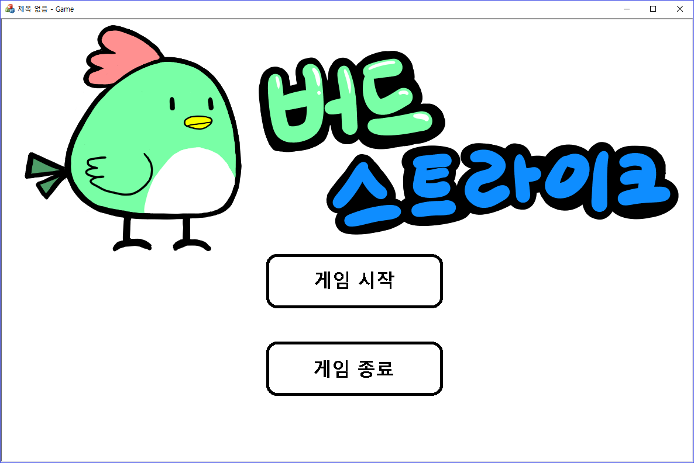
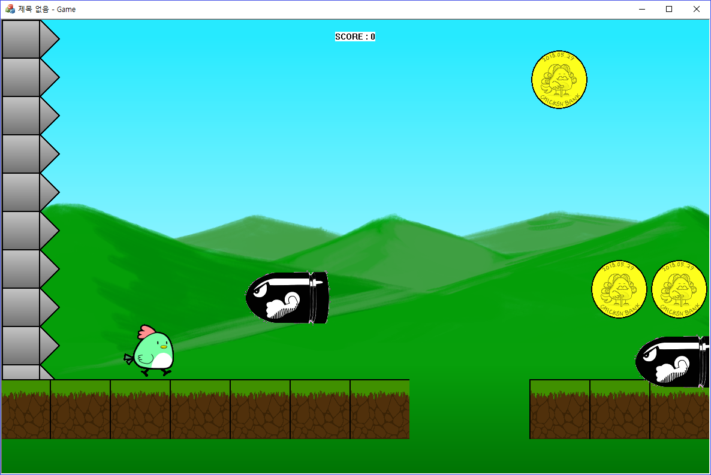
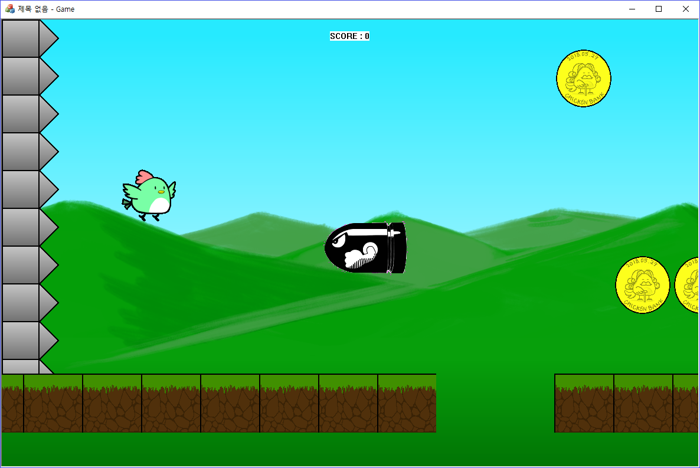
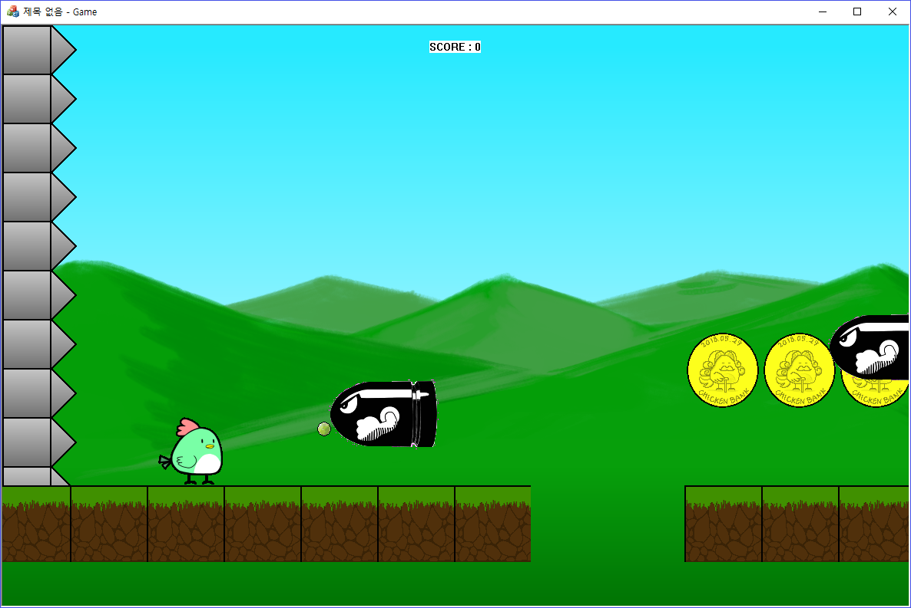
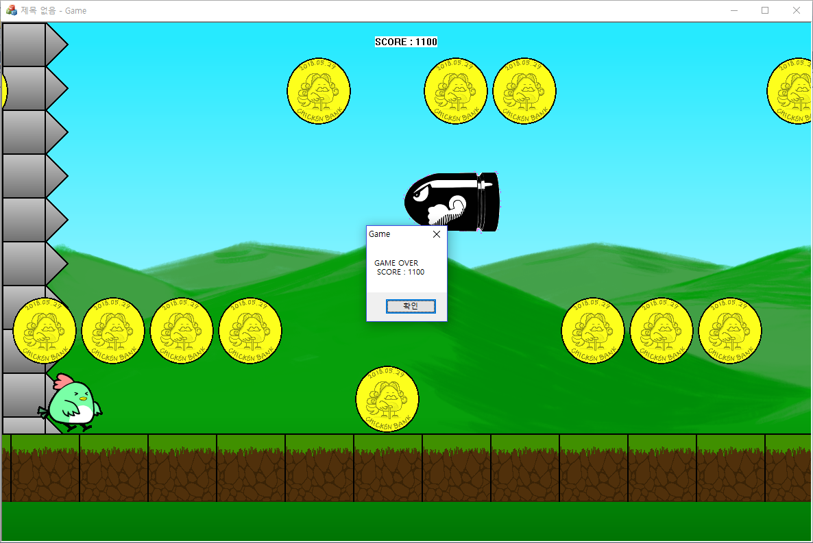
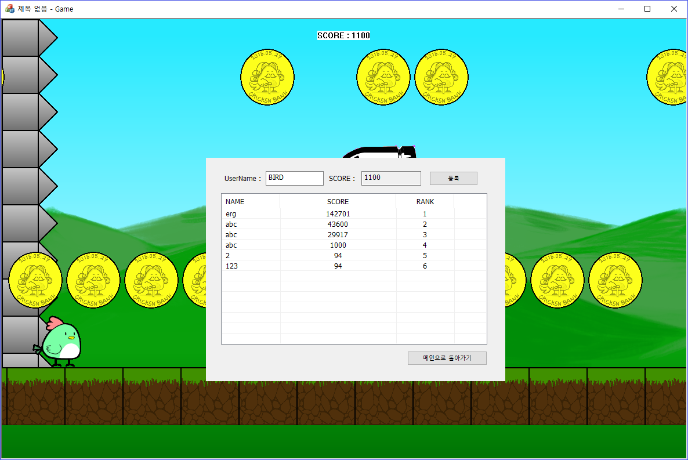

# BIRD STRIKE
2학년 윈도우즈 프로그래밍 프로젝트  

## 게임 설명
플레이어를 조작하여 최대한 멀리 이동시키는 러닝 액션 게임입니다.

## 개발 환경
- Microsoft Visual Studio 2013  
- MFC  
- C++  

## 게임 방식
- 스페이스 바를 눌러 점프 할 수 있습니다. 공중에서 한 번 더 점프할 수 있습니다.  
- 장애물과 충돌하면 뒤로 밀려납니다. 장에물에 세 번 충돌하면 벽과 충돌하여 게임이 종료됩니다.  
- 마우스를 클릭하여 총알을 발사 할 수 있습니다. 장애물에 총알이 맞으면 장애물이 사라집니다. 총알은 이전 총알이 사라지기 전까지 발사 할 수 없습니다.
- 장애물을 제거하거나 동전을 획득하여 점수를 획득할 수 있습니다.
- 게임 종료 후, 자신의 점수를 리더보드에 등록할 수 있습니다. 리더보드는 점수를 기준으로 내림차순으로 정렬됩니다.

## 게임 화면
시작 화면  
  
게임 화면  
  
점프  
  
총알 발사  
  
게임 종료  
  
점수 등록  
  
  
  
